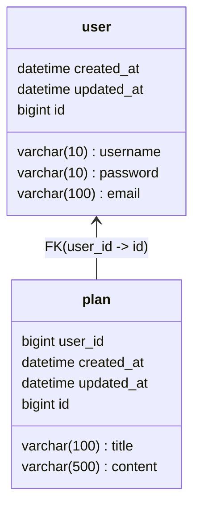

# SpartaPlanner

Spring JDBC 활용 및 CRUD API 구현 숙달을 위한 일정관리 API

남은 할 일: Domain, Service 분리, Web View 구현

## API Table

<details>
<summary>POSTMAN API DOCUMENTATION</summary>
<div style="background-color: black">

# 📁 Folder: 일정 


## End-point: 일정 생성
Body를 양식에 맞게 보내면, 자동으로 id가 부여되며 데이터가 저장됩니다.
### Method: POST
>```
>/api/plan
>```
### Body (**raw**)

```json
{
    "title":"제목",
    "content":"내용",
    "username":"작성자",
    "password":"0000"
}
```

### Response: 200
```json
{
    "id": 7,
    "title": "제목",
    "content": "내용",
    "username": "작성자",
    "createdDatetime": "2024-10-02T19:59:36.496815",
    "lastDatetime": "2024-10-02T19:59:36.496815"
}
```

## End-point: 일정 전체 조회
전체 일정 데이터를 리스트로 조회합니다.
### Method: GET
>```
>/api/plan
>```
### Response: 200
```json
[
    {
        "id": 4,
        "title": "수정된 제목",
        "content": "수정된 내용",
        "username": "사용자 A",
        "createdDatetime": "2024-10-02T19:24:17",
        "lastDatetime": "2024-10-02T19:25:54"
    },
    {
        "id": 6,
        "title": "제목",
        "content": "내용",
        "username": "작성자",
        "createdDatetime": "2024-10-02T19:32:29",
        "lastDatetime": "2024-10-02T19:32:29"
    }
]
```

## End-point: 일정 조회
기본 키인 id로 특정 일정 데이터 하나를 조회합니다.
### Method: GET
>```
>/api/plan/
>```
### Response: 200
```json
{
    "id": 7,
    "title": "제목",
    "content": "내용",
    "username": "작성자",
    "createdDatetime": "2024-10-02T19:59:36",
    "lastDatetime": "2024-10-02T19:59:36"
}
```

## End-point: 일정 수정
기본 키인 id로 특정 일정 데이터 하나를 조회하고, Body의 password 와 일치할 경우 해당 데이터를 수정합니다.
### Method: PUT
>```
>/api/plan/
>```
### Body (**raw**)

```json
{
    "title":"수정된 제목",
    "content":"수정된 내용",
    "username":"수정된 작성자",
    "password":"0000"
}
```

### Response: 200
```json
7
```

## End-point: 일정 삭제
기본 키인 id로 특정 일정 데이터 하나를 조회하고, 헤더의 password와 일치할 경우 해당 데이터를 삭제합니다.
### Method: DELETE
>```
>/api/plan/
>```
### Headers

|Content-Type|Value|
|---|---|
|password|0000|


### Response: 200
```json
7
```
# 📁 Folder: 사용자


## End-point: 사용자 생성
Body를 양식에 맞게 보내면, 자동으로 id가 부여되며 데이터가 저장됩니다.
### Method: POST
>```
>/api/user
>```
### Body (**raw**)

```json
{
    "username":"작성자",
    "password":"0000",
    "email":"1@email.com"
}
```

### Response: 200
```json
{
    "id": 7,
    "title": "제목",
    "content": "내용",
    "username": "작성자",
    "createdDatetime": "2024-10-02T19:59:36.496815",
    "lastDatetime": "2024-10-02T19:59:36.496815"
}
```

## End-point: 사용자 전체 조회
전체 일정 데이터를 리스트로 조회합니다.
### Method: GET
>```
>/api/user
>```
### Response: 200
```json
[
    {
        "id": 4,
        "title": "수정된 제목",
        "content": "수정된 내용",
        "username": "사용자 A",
        "createdDatetime": "2024-10-02T19:24:17",
        "lastDatetime": "2024-10-02T19:25:54"
    },
    {
        "id": 6,
        "title": "제목",
        "content": "내용",
        "username": "작성자",
        "createdDatetime": "2024-10-02T19:32:29",
        "lastDatetime": "2024-10-02T19:32:29"
    }
]
```

## End-point: 사용자 조회
기본 키인 id로 특정 일정 데이터 하나를 조회합니다.
### Method: GET
>```
>/api/user/
>```
### Response: 200
```json
{
    "id": 7,
    "title": "제목",
    "content": "내용",
    "username": "작성자",
    "createdDatetime": "2024-10-02T19:59:36",
    "lastDatetime": "2024-10-02T19:59:36"
}
```

## End-point: 사용자 수정
기본 키인 id로 특정 일정 데이터 하나를 조회하고, Body의 password 와 일치할 경우 해당 데이터를 수정합니다.
### Method: PUT
>```
>/api/user/
>```
### Body (**raw**)

```json
{
    "title":"수정된 제목",
    "content":"수정된 내용",
    "username":"수정된 작성자",
    "password":"0000"
}
```

### Response: 200
```json
7
```

## End-point: 사용자 삭제
기본 키인 id로 특정 일정 데이터 하나를 조회하고, 헤더의 password와 일치할 경우 해당 데이터를 삭제합니다.
### Method: DELETE
>```
>/api/user/
>```
### Headers

|Content-Type|Value|
|---|---|
|password|0000|


### Response: 200
```json
7
```

</div>
</details>

## ERD


## Project Hierarchy
```text
D:.
└───com
    └───sparta
        └───spartaplanner
            │   SpartaPlannerApplication.java
            │   
            ├───controller
            │       PlannerController.java
            │       UserController.java
            │       
            ├───dto
            │       PlanFilterRequestDto.java
            │       PlanFormRequestDto.java
            │       PlanViewResponseDto.java
            │       UserRequestDto.java
            │       UserResponseDto.java
            │
            ├───entity
            │       Plan.java
            │       User.java
            │
            ├───exception
            │       FailedRequestException.java
            │       FieldOverlapException.java
            │       IdNotFoundException.java
            │       PasswordFailException.java
            │
            └───repository
                    PlannerRepository.java
                    UserRepository.java
```

## TroubleShooting

[설계 & 트러블슈팅](https://mdworld.notion.site/10d75f72542580d990dcf8cb846bdae3?pvs=4)
